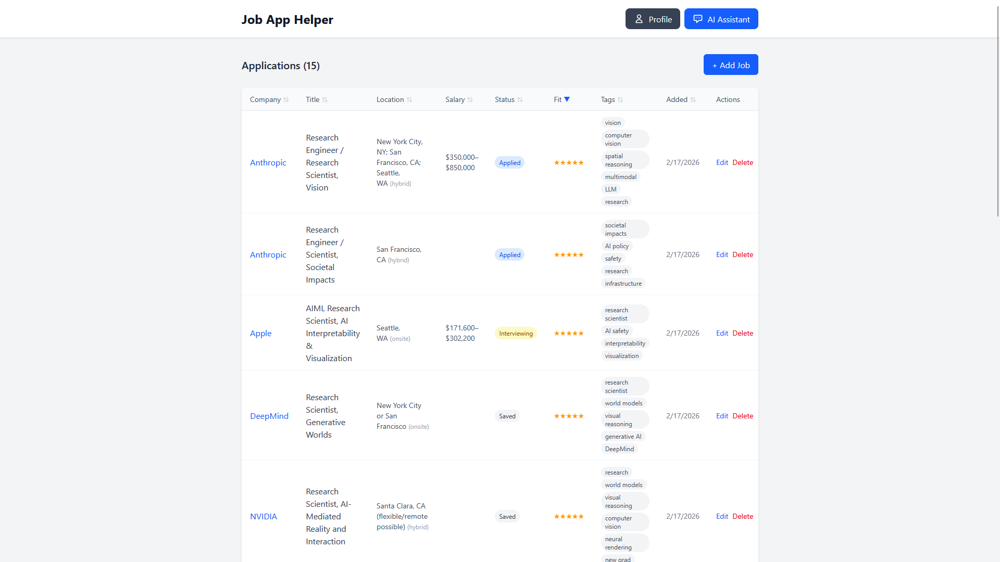
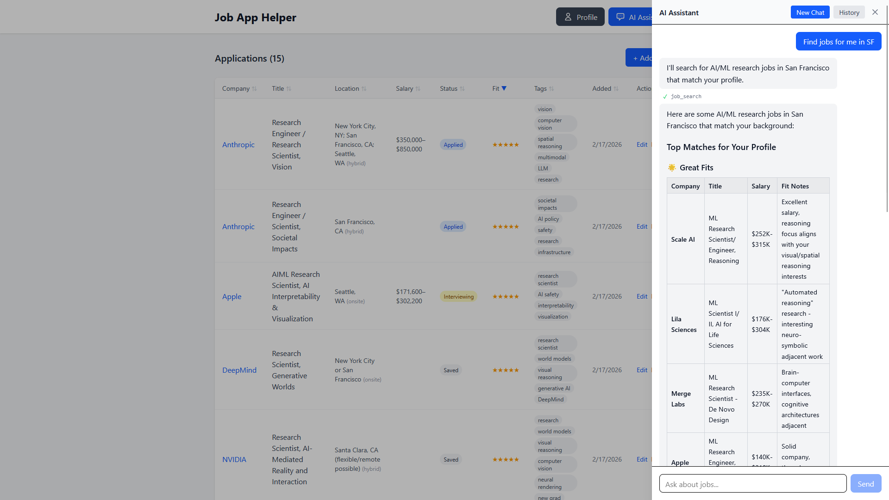
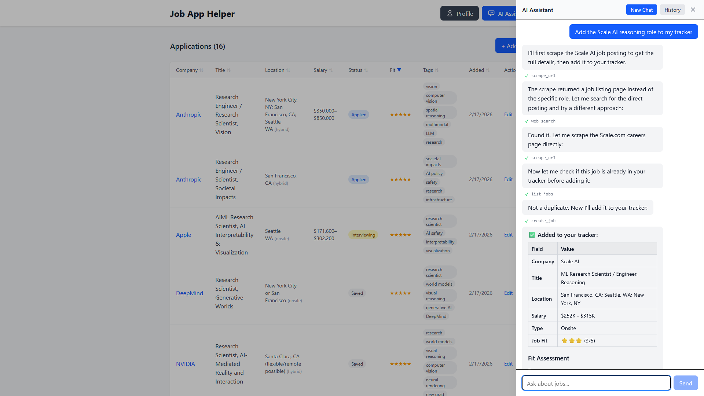
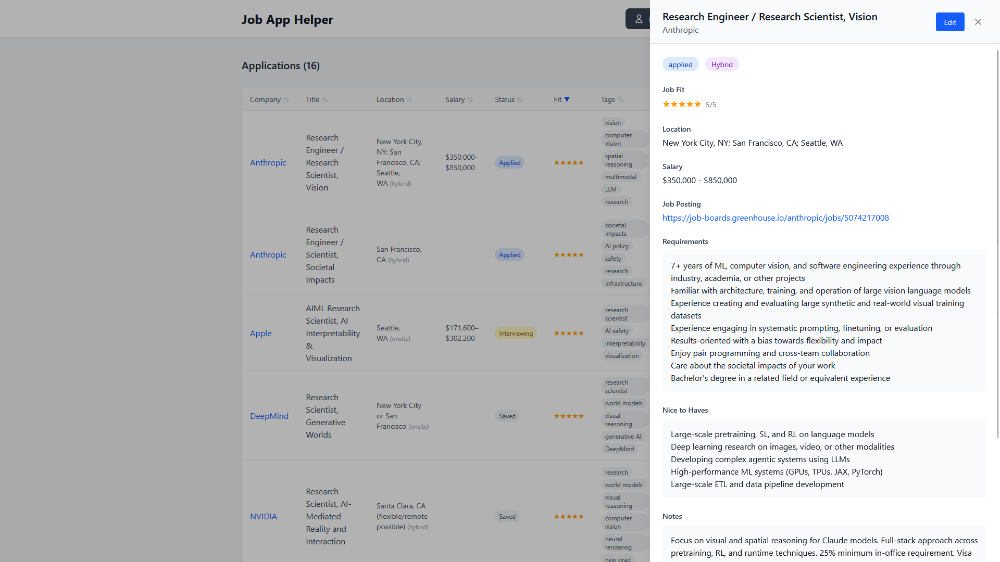
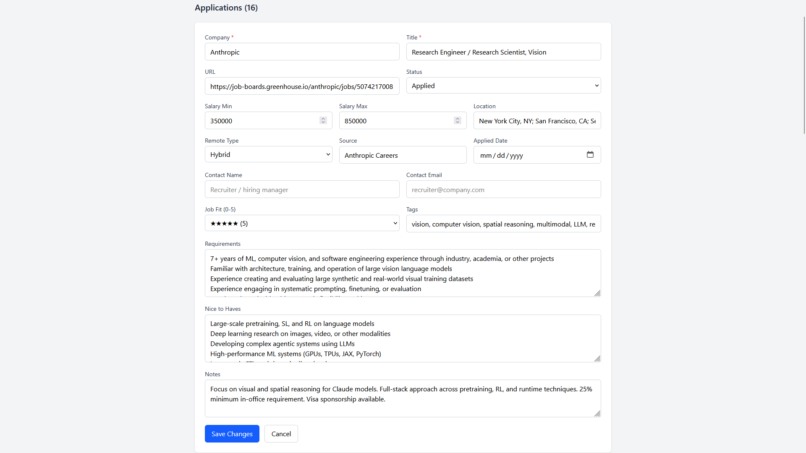
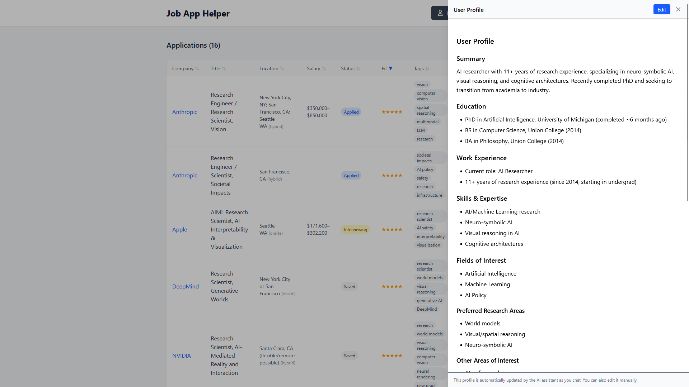
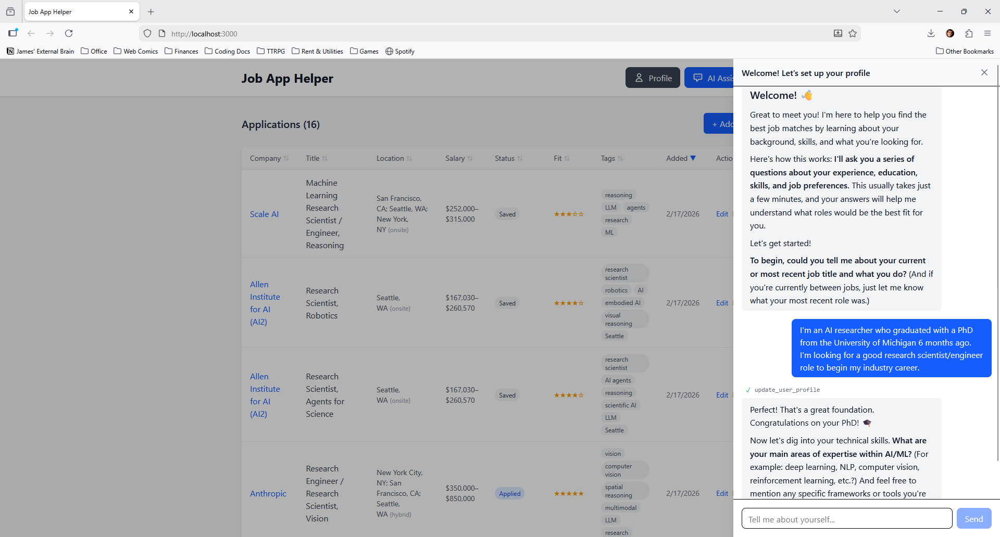

# Job Application Helper

[](https://opensource.org/licenses/MIT)

> A web application to track and manage job applications with an AI-powered assistant

Job Application Helper is a full-stack web app that helps you organize your job search. Track applications through the hiring pipeline, store job details, and leverage an AI assistant that can search the web, scrape job postings, and automatically add jobs to your tracker—all through a simple chat interface.

## Features

- **Job Tracking Dashboard**: Manage all your job applications in one place with sortable columns and status badges
- **AI-Powered Assistant**: Chat with an AI that can research jobs, scrape URLs, search job boards, and add jobs automatically
- **Multi-LLM Support**: Choose from Anthropic Claude, OpenAI GPT, Google Gemini, or run locally with Ollama
- **Web Search Integration**: Built-in web search (via Tavily) for finding job postings and company information
- **Job Board Integration**: Search Adzuna and JSearch job boards directly from the chat
- **User Profile System**: Personalized onboarding interview to understand your job preferences and goals
- **Rich Job Details**: Track salary ranges, location, remote type, requirements, contact info, and more
- **Job Fit Ratings**: Rate how well each job matches your profile (0-5 stars)

## Screenshots

### Dashboard
Manage all your job applications in one place with sortable columns, status badges, and quick actions.



### AI Assistant
Chat with the AI assistant to search for jobs, scrape URLs, and get personalized recommendations. The assistant uses tools like web search and job board APIs to help you find opportunities.





### Job Details
View comprehensive job information including requirements, nice-to-haves, salary, location, and job fit ratings.



### Add/Edit Jobs
Easily add new jobs or update existing ones with a clean, comprehensive form.



### User Profile
Manage your job search profile with preferences, skills, and goals. The AI uses this to personalize recommendations.



### Onboarding
First-time users go through a friendly interview to build their profile.



## Quick Start

### Prerequisites

- **Python 3.12+** — [Download](https://www.python.org/downloads/)
- **Node.js 18+** — [Download](https://nodejs.org/)
- **uv** — [Install](https://github.com/astral-sh/uv): `pip install uv`

### Installation

1. **Clone the repository**:

```bash
git clone https://github.com/yourusername/job_app_helper.git
cd job_app_helper
```

2. **Set up the backend**:

```bash
# Install Python dependencies
uv sync

# Run the Flask server
uv run python main.py
```

The backend API will be available at `http://localhost:5000`.

3. **Set up the frontend** (in a new terminal):

```bash
cd frontend
npm install
npm run dev
```

The frontend will be available at `http://localhost:3000`.

## Configuration

The AI assistant requires configuration via environment variables. Create a `.env` file in the project root or export these in your shell:

### Required Configuration

```bash
# Choose your LLM provider (anthropic, openai, gemini, or ollama)
export LLM_PROVIDER=anthropic

# API key for your chosen provider (not needed for Ollama)
export LLM_API_KEY=your-api-key-here
```

### Optional Configuration

```bash
# Override the default model for your provider
export LLM_MODEL=custom-model-name

# Enable web search (requires Tavily API key)
export SEARCH_API_KEY=your-tavily-api-key

# Enable job board search (choose one or both)
export JSEARCH_API_KEY=your-rapidapi-key       # JSearch (preferred)
export ADZUNA_APP_ID=your-adzuna-app-id        # Adzuna
export ADZUNA_APP_KEY=your-adzuna-app-key

# Use a cheaper model for onboarding (optional)
export ONBOARDING_LLM_MODEL=claude-haiku-4-5-20251001

# Logging level (DEBUG, INFO, WARNING, ERROR)
export LOG_LEVEL=INFO
```

### Provider Defaults

| Provider | Default Model | API Key Required |
|----------|---------------|------------------|
| `anthropic` | `claude-sonnet-4-5-20250929` | Yes ([Get key](https://console.anthropic.com/)) |
| `openai` | `gpt-4o` | Yes ([Get key](https://platform.openai.com/)) |
| `gemini` | `gemini-2.0-flash` | Yes ([Get key](https://aistudio.google.com/)) |
| `ollama` | `llama3.1` | No (runs locally) |

### Example: Using Anthropic Claude

```bash
export LLM_PROVIDER=anthropic
export LLM_API_KEY=sk-ant-...
export SEARCH_API_KEY=tvly-...
uv run python main.py
```

### Example: Using Ollama (Local)

Make sure the Ollama server is running locally on port 11434:

```bash
export LLM_PROVIDER=ollama
export LLM_MODEL=llama3.1  # or any model you have pulled
uv run python main.py
```

## Usage

1. **Start the application** — Follow the Quick Start steps above
2. **Open your browser** — Navigate to `http://localhost:3000`
3. **Complete onboarding** — On first visit, the AI assistant will interview you to build your profile
4. **Add jobs manually** — Click "Add Job" to create entries from the dashboard
5. **Use the AI assistant** — Click the chat icon to open the assistant panel:
   - Ask it to search for jobs: "Find software engineer jobs in San Francisco"
   - Scrape job postings: "Scrape this URL: https://example.com/job"
   - Research companies: "Search the web for info about Acme Corp"
   - The assistant will automatically add jobs to your tracker
6. **Track your progress** — Update job statuses (saved → applied → interviewing → offer/rejected)
7. **Manage your profile** — Click the profile icon to view or edit your job preferences

## Tech Stack

- **Backend**: Python, Flask, SQLAlchemy, SQLite
- **Frontend**: React 19, Vite, Tailwind CSS 4
- **AI Providers**: Anthropic Claude, OpenAI GPT, Google Gemini, Ollama
- **Package Managers**: uv (Python), npm (JavaScript)

## Development

For detailed technical documentation, development setup, API reference, and contribution guidelines, see:

- **[DEVELOPMENT.md](DEVELOPMENT.md)** — Comprehensive developer guide
- **[CONTRIBUTING.md](CONTRIBUTING.md)** — How to contribute to this project

## License

This project is licensed under the MIT License — see the [LICENSE](LICENSE) file for details.

## Acknowledgments

- [Tavily](https://tavily.com/) for web search API
- [Adzuna](https://www.adzuna.com/) and [JSearch](https://rapidapi.com/letscrape-6bRBa3QguO5/api/jsearch) for job search APIs
- Built with [Flask](https://flask.palletsprojects.com/), [React](https://react.dev/), and [Tailwind CSS](https://tailwindcss.com/)
